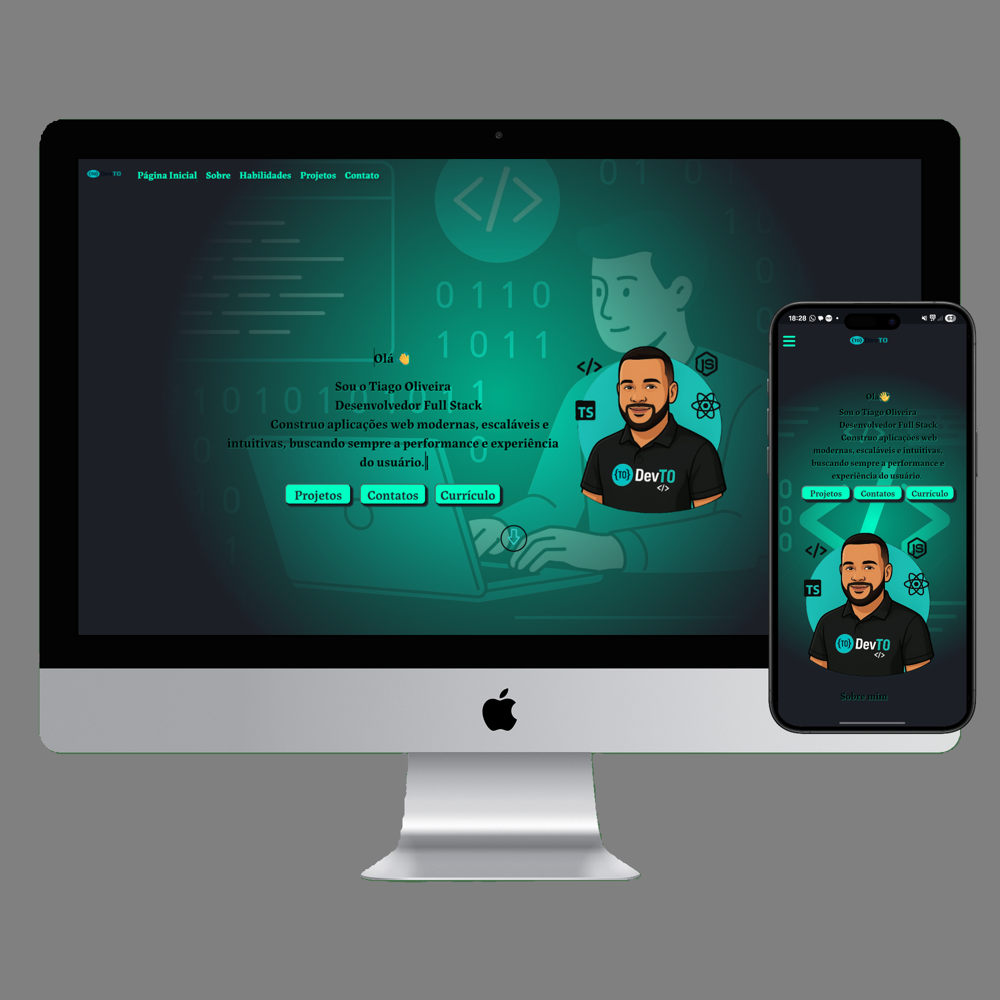

# 👨‍💻 Portfólio Profissional – Tiago Oliveira

  

Olá! Seja bem-vindo(a) ao meu portfólio. Este projeto foi criado com o objetivo de apresentar minha trajetória como Desenvolvedor Full Stack, destacar meus principais projetos e facilitar o contato para futuras oportunidades profissionais.

🔗 **Acesse o site:** [tiagliveira.github.io/portfoliodevto](https://tiagliveira.github.io/portfoliodevto/)  
📁 **Código-fonte:** [github.com/Tiagliveira/portfoliodevto](https://github.com/Tiagliveira/portfoliodevto)

---

## ✨ Sobre mim

Sou Tiago Oliveira, desenvolvedor com experiência em criação de aplicações web modernas, responsivas e funcionais. Tenho paixão por tecnologia, aprendizado contínuo e por transformar ideias em soluções digitais.

Minha formação e experiência me permitem atuar tanto no front-end (interface e experiência do usuário) quanto no back-end (lógica e estrutura dos dados).

---

## 🧠 Habilidades principais

- Desenvolvimento com **React**, **JavaScript** e **CSS**
- Criação de interfaces responsivas e intuitivas
- Versionamento de código com **Git** e **GitHub**
- Planejamento e organização de projetos
- Comunicação clara e foco em resultados

---

## 🛠️ Tecnologias utilizadas neste projeto

- **React + Vite**: para performance e desenvolvimento moderno
- **CSS**: para estilização e responsividade
- **GitHub Pages**: para publicação do site
- **Git**: para controle de versões

---

## 📱 O que você verá no site

- Uma apresentação profissional com design limpo
- Seção de projetos desenvolvidos
- Links para redes sociais e currículo
- Informações de contato direto

---

## 📈 Em desenvolvimento

Este portfólio está em constante evolução. Algumas melhorias planejadas:

- Adição de back-end com Node.js e banco de dados
- Tradução para inglês
- Testes automatizados

---

## 📬 Contato

Fico à disposição para entrevistas, propostas ou dúvidas:

📧 tiagliveira92@gmail.com  
🔗 [LinkedIn](https://www.linkedin.com/in/tiagoliveira-)

---

Obrigado por visitar meu portfólio!  
Estou pronto para contribuir com projetos inovadores e crescer junto com sua equipe. 🚀
